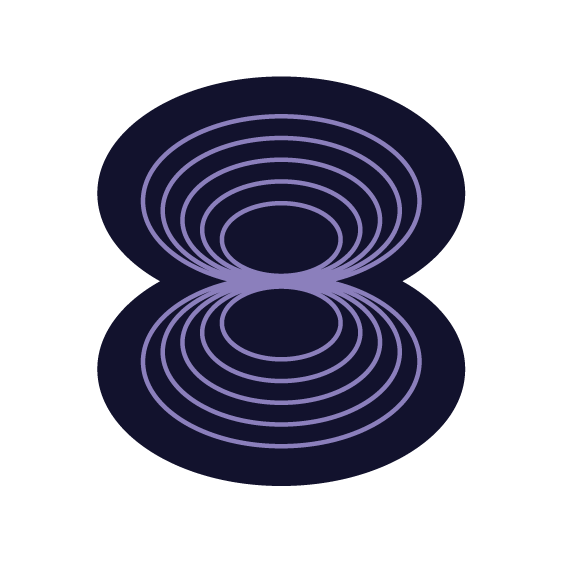

  

### About Me 👩🏻‍💻

I am a Molecular Biology Graduate Student specializing in **Life Science Informatics**, dedicated to bridging the gap between scientific Research & Development and computational tools for the global research community.

 

* Co-Lead Developer of **[PySSA](https://github.com/urban233/PySSA)**, a user-friendly application that integrates [PyMOL](https://pymol.org/2/) and [ColabFold](https://github.com/sokrypton/ColabFold),
allowing scientists to easily predict, analyze, and visualize 3D protein structures without needing programming skills.

   
   
   
  

 

* Lead Developer of **[PyMOL™ Open Source Setup](https://github.com/kullik01/pymol-open-source-setup)**, offers unofficial, cross-platform builds of the open-source version of PyMOL™.

  

 

* Lead Developer of **[Focus Bean](https://github.com/kullik01/Focus-Bean)**, a modern, elegant timer application designed for deep work and productivity.

  

---

### ⭐ Certificates

  <a href="https://courses.schrodinger.com/certificates/xcbdg2dsad" target="_blank">
    
  Visualizing Science with PyMOL 3
  </a>

  <a href="https://courses.schrodinger.com/certificates/hcu94t6jbk" target="_blank">
    
  Introduction to Molecular Modeling in Drug Discovery
  </a>

---

## 🧰 Toolbox

### Programming & UI

  <strong>⌨️ Main languages:</strong> 
  
  
  

  <strong>🎨 Frameworks & UI:</strong> 
  
  

 

### Computational Biology & Data Science

  <strong>🧊 Molecular Modelling & Structure Prediction:</strong> 
  
  
  

  
  

  <strong>📊 Scientific Computing & Data Analysis:</strong> 
  
  

 

### Infrastructure, Data & OS

  <strong>🖥️ Operating Systems:</strong> 
  
  
  
  

  <strong>⚙️ IDEs & Static Analysis:</strong> 
  
  
  
  
  
  

  <strong>🗄️ Database & Environment Management:</strong> 
  
  
  
  
  
  

 

### Productivity, Design & Multimedia

  <strong>📝 Office Suite & Collaboration:</strong> 
  
  
  
  

  <strong>🖌️ Design & Multimedia:</strong> 
  
  
  
  

 

### AI

  
  
  

